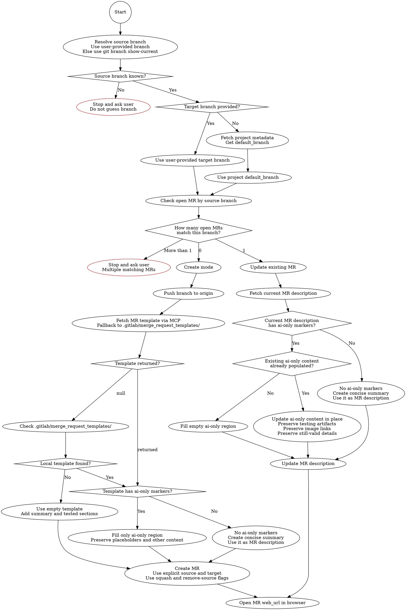

# GitLab Merge Request

## Decision Map



## Routing First

Before any MR action, decide whether this is a create flow or an update flow.

Use GitLab MCP for MR operations and GitLab user lookup.

The `project_id` is the URL-encoded project path (e.g. `full-stack%2Factivities%2Factivities-web`). Resolve it from `git remote get-url origin` if not already known.

### Step 1 - Resolve the source branch

- If the user names the branch, use it.
- Otherwise, resolve it explicitly with `git branch --show-current`.
- If the branch is still unclear or detached, stop and ask instead of guessing.

### Step 2 - Resolve the target branch

- If the user names the target branch, use it directly.
- Otherwise, use the project's default branch. Do not hardcode `main` or `master`.

```bash
! git ls-remote --symref origin HEAD
```

Parse the first line: `ref: refs/heads/<branch>	HEAD`, then extract `<branch>` as the default branch. Run this command on its own; do not chain it with `&&`.

### Step 3 - Detect existing open MRs for the source branch

```
mcp__gitlab__get_merge_request(project_id=<project>, source_branch=<branch-name>)
```

Routing rules:

- If a single open MR is returned, do not create a duplicate. Route to update mode for that MR.
- If multiple open MRs are returned, stop and ask which MR to update.
- If no open MR exists, continue with create mode.

### Assignee resolution

Resolve the MR assignee before create or update:

- If GitLab MCP is available, use `mcp__gitlab__get_current_user()` for the default assignee or `mcp__gitlab__get_user_by_username(username=<username>)` for a named assignee, then pass `assignee_ids=[<id>]`.
- If only `glab` is available, resolve the username with `glab auth status` for the authenticated user or the user-provided username, then pass `--assignee <username>` on create or update.
- If assignee resolution fails, stop and ask instead of creating or updating an unassigned MR.

## Create Mode

### Step 4 - Push the branch

```bash
git push -u origin <branch-name>
```

### Step 5 - Fetch the MR template

```
mcp__gitlab__get_mr_description_template(project_id=<project>)
```

- If the call fails (error), stop and ask the user what to do next.
- If it returns `null`, check `.gitlab/merge_request_templates/` in the repo for a template file. Use the first one found.
- If no local template exists either, use an empty template and fill in a summary of changes and a "How it was tested" section.

### Step 6 - Build the description

If the template contains `<!-- ai-only-start -->` and `<!-- ai-only-end -->` markers, only fill data inside those markers. Keep the existing structure and headings within the markers exactly as-is, only substitute the actual values (JiraId, ExpId, FeatureName, changes summary, tested scenarios). Preserve everything outside the markers exactly as-is, including `{{placeholders}}`, URLs, FAQ text, and `/assign me`.

If the template has no `ai-only` markers, create a concise summary of the changes and use that as the MR description.

### Step 7 - Create the MR

```
mcp__gitlab__create_merge_request(
  project_id=<project>,
  title=<title>,
  source_branch=<branch>,
  target_branch=<target>,
  description=<description>,
  assignee_ids=[<resolved-assignee-id>],
  squash=true,
  remove_source_branch=true
)
```

Always set `squash=true` and `remove_source_branch=true`.

## Update Mode

### Step 4 - Fetch the current MR description

```
mcp__gitlab__get_merge_request(project_id=<project>, merge_request_iid=<mr-iid>)
```

Read the `description` field from the response.

### Step 5 - Build the updated description

If the current description contains `<!-- ai-only-start -->` and `<!-- ai-only-end -->`:

- If the `ai-only` region is empty, fill it.
- If the `ai-only` region already contains useful content, update it in place instead of replacing it wholesale.
- Preserve testing artifacts, image links, and still-valid details already present inside the `ai-only` region.

If the current description has no `ai-only` markers, create a concise summary of the changes and use that as the MR description.

### Step 6 - Send the update

```
mcp__gitlab__update_merge_request(
  project_id=<project>,
  merge_request_iid=<mr-iid>,
  description=<updated>,
  assignee_ids=[<resolved-assignee-id>]  # only when the MR has no assignee or the user requested an assignee change
)
```

## Final Step - Open the MR in the browser

After a successful create or update call, open the MR's `web_url` in the browser.

```bash
open "<mr-web-url>"
```

Use the `web_url` from the successful MR response or from the fetched MR record. If it is missing, fetch the MR again with `mcp__gitlab__get_merge_request` and use its `web_url`. If the browser open command fails, report the MR URL and the opener error. Do not retry or repeat the create or update call.

## What to Avoid

- **Do not hardcode `master` or `main`.** Use the user-provided target branch or resolve the project default branch dynamically.
- **Do not create an MR before checking for an existing open MR on the same source branch.**
- **Do not silently continue if template fetch fails.** Stop and ask the user what to do next.
- **Do not modify anything outside AI-managed markers.** `{{placeholders}}`, URLs, FAQ text, and `/assign me` belong to the author/template.
- **Do not replace `{{sourceBranch}}` or other template placeholders outside AI-managed sections.**
- **Do not invent `codex-ai-summary` blocks in this workflow.** The only managed region is the existing `ai-only` block when the template provides one.
- **Do not replace populated `ai-only` content wholesale during updates.** Update it in place and preserve testing artifacts, image links, and still-valid details.
- **Do not omit `squash=true` and `remove_source_branch=true`.** Always set both on MR creation.
- **Do not use `glab api user` or `glab api "users?username=..."` for normal assignee resolution.** Use the GitLab MCP user tools.
- **Do not create an unassigned MR.** Resolve an assignee ID and pass it on create unless the user explicitly asks for an unassigned MR.
- **Do not create the MR before pushing.** The branch must exist on remote before calling `mcp__gitlab__create_merge_request`.
- **Do not finish silently after a successful create or update.** Open the MR in the browser, or report the MR URL and opener error if local browser opening fails.
