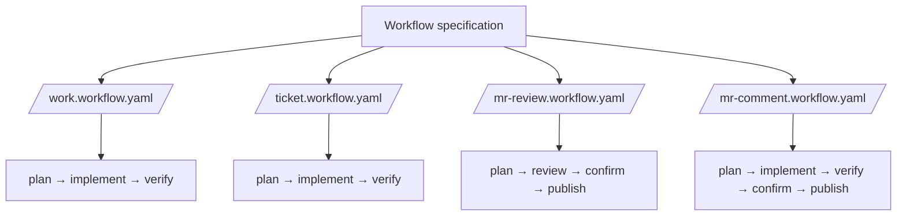

# Local workflow specification

This directory defines the local workflow specification in `agent/workflows/`.
The four YAML specifications compose stage prompts in `agent/workflows/steps/`.

Shell search is restricted to `rg` and `rg --files`. `gh_grep` remains an
approved MCP code-search integration.

Relevant Superpowers skills are declared by stage: planning uses
`brainstorming` and `writing-plans`; implementation uses `executing-plans`,
`systematic-debugging`, and `test-driven-development`; verification uses
`verification-before-completion` and `requesting-code-review`.
