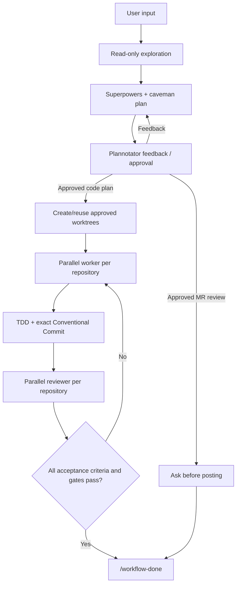

## Workflow commands

`workflow-commands.ts` provides four approval-gated Pi workflows:

| Command | Input | Outcome |
|---|---|---|
| `/work <requirement>` | Any local requirement and context | Explore, plan, approve, implement, verify, commit. |
| `/ticket <Jira ID or URL> [context]` | Ticket plus optional extra information | Fetch Jira, explore all repositories, plan, approve, implement, verify, commit. |
| `/mr-comments <HTTPS review URL> [context]` | GitLab, GitHub, GitHub Enterprise, or another hosted review | Read unresolved threads, plan fixes/replies, approve, fix and commit, then ask before push/reply. |
| `/mr-review <HTTPS review URL> [context]` | Any supported hosted review | Read review data and code, plan findings, approve, then ask before posting comments. |

Each command enters Plannotator planning. One workflow remains active until `/workflow-done` or `/workflow-abort`.

## Workflow



Planning exploration supports `rg`, `rg --files`, `ast-grep`, read-only Git and hosted-code CLI commands, read-only Atlassian/GitLab/GitHub/Sourcegraph or other MCP operations, and read-only web tools. Local or remote mutation remains blocked before approval.

## Plan contract

Plan first line preserves route:

```text
Workflow: local-work
Workflow: jira-ticket
Workflow: gitlab-mr-comments
Workflow: gitlab-mr-review
```

Required headings:

```text
Goal
In scope
Out of scope
Evidence
Things to implement
Implementation plan
Requirement-to-test mapping
Done when
Verification contract
Skill recommendation
Open questions
Risks
```

Every implementation action and acceptance criterion uses `- [ ]`. Every `Done when` criterion maps to an implementation item and exact check.

Code plans use:

```json
{
  "repositories": [
    {
      "cwd": "/absolute/worktree/git-root",
      "sourceCwd": "/absolute/source-repository/git-root",
      "baseHead": "0123456789abcdef0123456789abcdef01234567",
      "branch": "fix-cache",
      "commitTitle": "fix(cache): prevent stale reads",
      "acceptanceCriteria": [
        "Cancelled bookings cannot return stale cache entries."
      ],
      "worker": [
        {
          "id": "focused-tests",
          "command": "npm test -- cache",
          "timeoutMs": 120000
        }
      ],
      "reviewer": [
        {
          "id": "full-tests",
          "command": "npm test",
          "timeoutMs": 600000
        },
        {
          "id": "format",
          "command": "npm run format:check",
          "timeoutMs": 120000
        },
        {
          "id": "lint",
          "command": "npm run lint",
          "timeoutMs": 120000
        }
      ]
    }
  ]
}
```

Rules:

- repository `cwd` values are unique absolute worktree roots beneath configured `worktreeBaseDir`;
- `sourceCwd` is the exact absolute source Git root and `baseHead` is its approved HEAD; a reused `cwd` must share that source repository's Git common directory;
- `commitTitle` follows Conventional Commits;
- `acceptanceCriteria` exactly match the approved plan;
- runtime acceptance criteria and commands match contract;
- reviewer IDs are exactly `full-tests`, `format`, and `lint`;
- format/lint commands are non-fixing;
- multiple repositories launch as one parallel worker call, then one parallel reviewer call;
- a new worktree uses only `git -C <sourceCwd> worktree add -b <branch> <cwd> <baseHead>`;
- worker completion requires the exact approved commit title, a clean worktree, and structured per-criterion, failed RED, passing GREEN, and test-change evidence; and
- `/workflow-done` requires every repository gate and unchanged post-review snapshot.

Read-only plan:

```text
Not applicable - read-only plan.
```

After approval, a read-only plan runs one foreground fresh scout with attested acceptance, the exact `Done when` criteria, and per-criterion evidence before it can complete.

## Worktree naming

Configured base: `agent/extensions/subagent/config.json`.

- `/work`: branch `<summary>`, directory `<source-repository>-<summary>`. Summary is lowercase ASCII hyphen form, maximum 20 characters.
- `/ticket`: branch `<JIRA-ID>_<summary>`, directory `<source-repository>-<JIRA-ID>_<summary>`. Summary uses the same lowercase-hyphen 20-character limit. Extra command context is optional; plan derives it from user context plus authoritative ticket.
- `/mr-comments`: branch `<session-key>`, directory `<session-key>`. No additional prefix is added.

Worktrees are created or reused only after approval. User remains in shared checkout.

## Review hosts and confirmation

Review commands accept an HTTPS URL followed by optional context. Platform-specific retrieval order:

1. matching read-only MCP;
2. authenticated `glab`, `gh`, or host CLI;
3. trusted same-host GET/HEAD `curl`.

Hosted-review plans include a `Remote action contract`; `actions` may be empty for a clean review. Every proposed comment, reply, or non-force push has one exact `toolName` and exact object `input` bound to the review platform and URL target. Approval alone never authorizes those calls.

`/mr-review` never posts automatically. After plan approval and its read-only scout gate, it asks whether to execute every exact approved comment call.

`/mr-comments` implements approved fixes with TDD and a Conventional Commit, verifies them, then asks whether to execute every exact approved push and reply call. Reply-only plans run the read-only scout gate and also ask first. Each successful tool result is correlated to its contract action. No force push, approval, merge, thread resolution, closure, deletion, or unlisted remote mutation is implied.

## Active-loop commands

| Command | Meaning |
|---|---|
| `/workflow-status` | Show workflow, iteration, approved plan, repository count, and gates. |
| `/workflow-retry` | Retry preserved transition. |
| `/workflow-done` | Finish only after all acceptance criteria and gates pass. |
| `/workflow-abort` | Abandon without completion claim. |
| `/workflow-continue` | Resume aborted workflow through a new planning iteration. |

Later scope changes re-enter planning and require approval. Direct answers to extension-generated post-review posting questions are treated as confirmations, not new scope.

After session restoration, interrupted scout, worker, or reviewer calls become failed/retryable gates. An interrupted remote action is cleared and requires a fresh user decision, so stale tool-call IDs cannot deadlock the workflow.

## Verification

```text
node --check agent/extensions/workflow-commands.ts
node --test agent/tests/workflow-commands.test.ts
git diff --check
```

Source map:

- `agent/extensions/workflow-commands.ts`
- `agent/workflows/*.md`
- `agent/plannotator.json`
- `agent/settings.json`
- `agent/AGENTS.md`
- `agent/tests/workflow-commands.test.ts`
