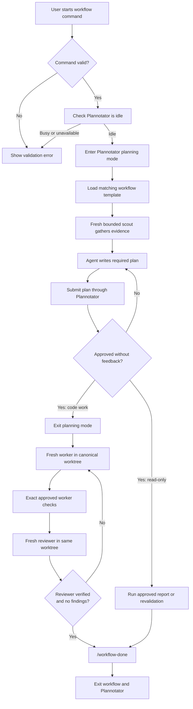

## Workflow extension mental model



Extension creates one active workflow at time. It persists workflow state in session custom entries, so it can restore active loop after reload or session restoration.

## Start the right workflow

Run in Pi TUI.

| Command | Input | Use it for |
|---|---|---|
| `/work <task>` | Local requirement | Local implementation, bug fix, or read-only investigation. |
| `/ticket <Jira key or URL> <rough description>` | Jira issue plus short description | Ticket-driven investigation or implementation. |
| `/mr-review <GitLab MR URL>` | Merge request URL | Read-only review and, after approval, posting exact planned comments. |
| `/mr-comments <GitLab MR URL>` | Merge request URL | Triage existing review discussions; may make approved comment replies or non-force push actions. |

Examples:

```text
/work Fix cache invalidation when a booking is cancelled.
/ticket ABC-123 Fix cache invalidation
/mr-review https://gitlab.example.com/group/project/-/merge_requests/42
/mr-comments https://gitlab.example.com/group/project/-/merge_requests/42
```

`/mr-review` and `/mr-comments` reject input is not HTTP(S) GitLab merge-request URL.

## What happens after `/work`

1. Extension requires Plannotator to be idle, then enters planning mode.
2. It loads `.pi/agent/workflows/local-work.md` and appends your task as `Workflow input`.
3. Planning stays read-only. No production code edits, worktree creation, dependency installs, commits, or external mutations are allowed.
4. Workflow requires one fresh, bounded, read-only `scout` before plan submission. A `researcher` is allowed for independent external-fact question.
5. The plan must begin with `Workflow: local-work` and use all required headings.
6. Plannotator approval binds exact plan content and repository snapshot.
7. Code work: extension leaves planning mode and starts fresh sole `worker` in approved canonical worktree.
8. Worker must report verified runtime acceptance ledger for exact approved commands.
9. A fresh read-only `reviewer` repeats exact reviewer contract. It must report `reviewFindings: []` before completion.
10. Run `/workflow-done` after all applicable gates are verified.

## Required plan shape

Every workflow plan must have these headings in this order of purpose:

```text
Workflow: <workflow marker>

Goal
In scope
Out of scope
Evidence
Things to implement
Implementation plan
Requirement-to-test mapping
Done when
Verification contract
Skill recommendation
Open questions
Risks
```

Use evidence labels consistently:

- `FACT`: source-backed claim, including `path:line` for code.
- `HYPOTHESIS`: confidence plus falsifier.
- `UNKNOWN`: missing fact plus next check.

`Implementation plan` must have at least one executable `- [ ]` item, including read-only report or revalidation outcome.

### Code-work verification contract

For implementation or bug-fix work, `Verification contract` must be one machine-readable JSON block containing only:

```json
{
  "cwd": "/absolute/canonical/worktree/path",
  "worker": [
    { "id": "focused-test", "command": "...", "timeoutMs": 120000 }
  ],
  "reviewer": [
    { "id": "full-tests", "command": "...", "timeoutMs": 120000 },
    { "id": "format", "command": "...", "timeoutMs": 120000 },
    { "id": "lint", "command": "...", "timeoutMs": 120000 }
  ]
}
```

Rules enforced by extension:

- every command is one line and has positive `timeoutMs`;
- runtime commands must match approved IDs, text, ordering, and timeouts exactly;
- reviewer IDs must be exactly `full-tests`, `format`, and `lint`;
- format and lint are check-only, never auto-fixing;
- worker and reviewer must complete with verified acceptance; and
- reviewer must report empty `reviewFindings` array.

Read-only plan: write exactly:

```text
Not applicable - read-only plan.
```

Extension then blocks code workers and reviewers. It also hashes repository state and refuses completion if that state changes after approval.

## Worker and reviewer roles

The local configuration permits four active subagent roles:

| Role | Purpose | Default skills |
|---|---|---|
| `scout` | One bounded, read-only repository evidence question. | None inherited. |
| `researcher` | Independent current external-fact stream only. | None inherited. |
| `worker` | Sole code and test writer in approved worktree. | `test-driven-development`, `verification-before-completion`, `receiving-code-review` |
| `reviewer` | Independent final gate after worker passes. | `verification-before-completion` |

Workflow extension rejects ad-hoc worker or reviewer delegation outside approved workflow contract. It also rejects contracts that use different working directory or different verification commands.

## Worktree rules for code workflows

The approved `cwd` is not arbitrary. Extension derives and preserves one canonical worktree identity under configured `worktreeBaseDir` from `.pi/agent/extensions/subagent/config.json`.

- Local work and merge-request workflows use `pi-session-<session-key>` identity.
- Jira code workflows use `<source-repository-name>-<JIRA_TICKET_ID>_<rough-description>` for their canonical worktree directory. The branch uses `<JIRA_TICKET_ID>_<rough-description>`. The rough description is required after ticket ID or URL, normalized to lowercase ASCII hyphen-separated text.
- Reuse canonical worktree across follow-up iterations.
- Never create temporary fallback worktree.
- Never create worktree during planning.

The plan, worker launch, reviewer launch, and final gate must all refer to same canonical `cwd`.

## Ticket workflow differences

`/ticket` uses `Workflow: jira-ticket` and `.pi/agent/workflows/jira-ticket.md`. Code work: use `/ticket <Jira key or URL> <rough description>` so branch is `<JIRA_TICKET_ID>_<rough-description>` and worktree directory is `<source-repository-name>-<JIRA_TICKET_ID>_<rough-description>`.

- Ticket information is read early through Jira tooling before ticket-derived claims.
- Initial read-only exploration can include repository snapshots, memory, instructions, and skills.
- A ticket can cover more than one repository session. Each approved repository session requires fresh explicit approval.
- Ticket mutations still require explicit user authorization.
- Commit, push, merge-request creation, tag, or version bump is never implied by plan approval.

## Merge-request workflow differences

### `/mr-review`

This route is remote-read-only during planning. It fetches current merge-request metadata, source/target branches, head SHA, diff, pipelines, discussions, and changed-file context.

After approval, it re-fetches head SHA and discussions. If evidence or anchors changed, it returns to planning. It may post exact approved comments. It cannot edit code, create worktree, approve, merge, or resolve discussions.

### `/mr-comments`

This route triages unresolved review discussions. It follows same approval and refresh requirements. Workflow template permits exact approved replies and any exact approved non-force push action; no unrelated remote action is authorized.

## Control an active workflow

| Command | Meaning |
|---|---|
| `/workflow-status` | Read-only view of active workflow, iteration, plan hash, contract, and gate state. |
| `/workflow-retry` | Retry preserved follow-up transition only. Never use as generic restart. |
| `/workflow-abort` | End active workflow without claiming completion. Preserves resumable state. |
| `/workflow-continue` | Restore aborted workflow and resume planning. |
| `/workflow-done` | Complete when current plan and all required gates pass. |

A later user follow-up is **not** covered by prior approval. Extension queues it as new iteration. The next planning pass must refresh evidence with new scout, add iteration delta under `Evidence`, revise same plan, and collect another approval.

## Project-specific template override

A repository can override one workflow template without changing global extension:

```text
<repository>/.pi/workflows/
├── local-work.md
├── jira-ticket.md
├── gitlab-mr-review.md
└── gitlab-mr-comments.md
```

When present, extension reads project-local template before falling back to `.pi/agent/workflows/`. Keep its `Workflow: <marker>` line correct and preserve extension-required rules and plan headings.

## Efficient use

1. Pick route first. Never use `/work` for merge-request review or `/mr-review` for local code change.
2. Give narrow input. Include symptom, intended outcome, known reproduction, and constraints.
3. Let planning finish before asking for edits. Approval controls mutation authority.
4. Review submitted plan, especially `In scope`, `Out of scope`, `Evidence`, and exact verification contract.
5. Code work: require focused test before full-suite, format, and lint checks.
6. Use `/workflow-status` when uncertain; do not bypass workflow with ad-hoc worker or reviewer calls.
7. Send corrections as follow-ups. Extension preserves work but requires fresh approved iteration.
8. Use `/workflow-abort` if objective changes materially, then `/workflow-continue` when ready to re-plan.

## Troubleshooting

| Symptom | Likely reason | Safe next action |
|---|---|---|
| Workflow will not start | Plannotator is not idle, unavailable, or did not enter planning mode. | Finish or exit existing planning work, then retry command. |
| Plan approval does not start worker | Plan had feedback, changed while pending, missing contract, or Plannotator could not exit. | Revise and resubmit; inspect `/workflow-status`; use `/workflow-retry` for preserved transition. |
| Worker or reviewer blocked | Contract, role, `cwd`, or acceptance command differs from approved plan. | Fix plan or launch parameters through new approved iteration. |
| `/workflow-done` blocked | Pending follow-up, changed repository/plan, missing worker gate, reviewer failure, or findings remain. | Read status, resolve through planned worker/reviewer cycle, then retry. |
| Follow-up ignored or blocked | A workflow transition is in progress or needs replanning. | Wait for transition, then let new iteration enter planning. |

## Source map

- Extension behavior: `.pi/agent/extensions/workflow-commands.ts`
- Local workflow: `.pi/agent/workflows/local-work.md`
- Jira workflow: `.pi/agent/workflows/jira-ticket.md`
- Merge-request review workflow: `.pi/agent/workflows/gitlab-mr-review.md`
- Merge-request comment workflow: `.pi/agent/workflows/gitlab-mr-comments.md`
- Role policy: `.pi/agent/settings.json` and `.pi/agent/AGENTS.md`
- Regression tests: `.pi/agent/tests/workflow-commands.test.ts`
