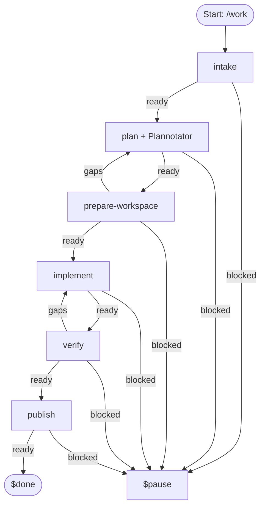
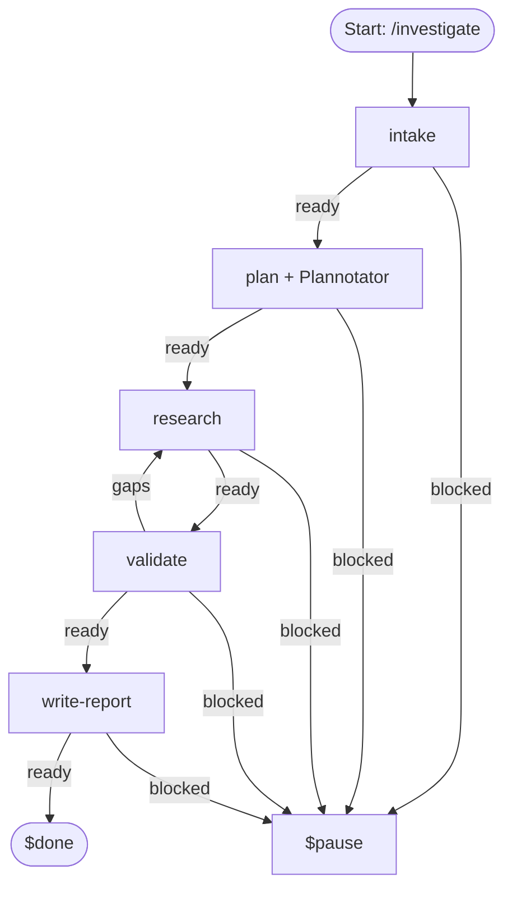
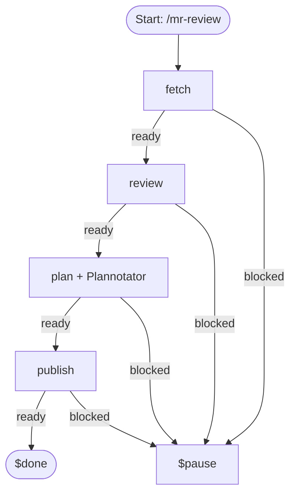
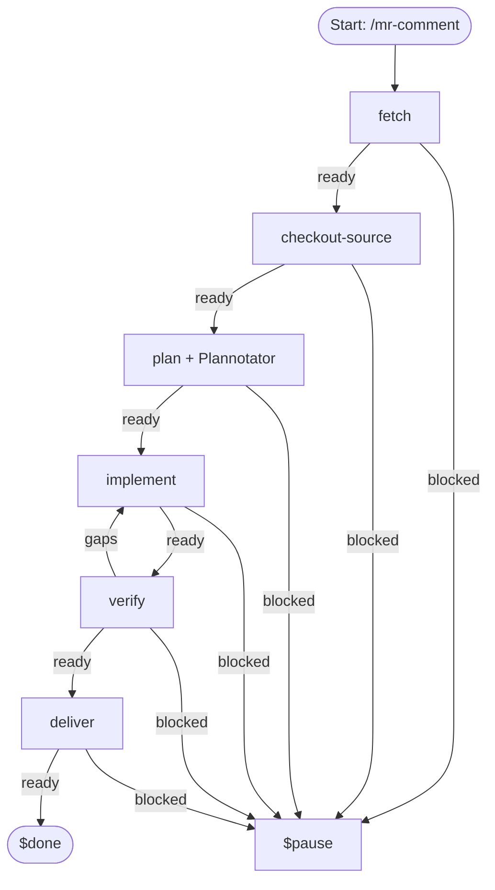
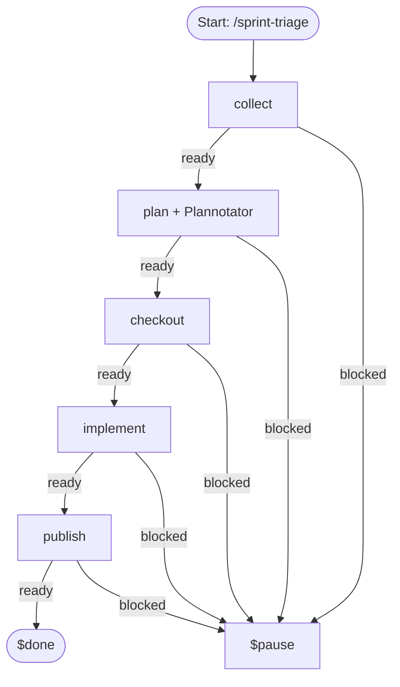

# Workflow Specifications

This directory defines autonomous workflow specifications in `agent/workflows/` composed from stage prompts in `agent/workflows/steps/`. A `handoff` outcome from any step re-enters that same step with its handoff context.

---

## 1. `/work` — Requirement or Jira Work
Normalizes a free-form requirement or verifies one Jira key, then drafts a Plannotator plan **before** creating the approved deterministic worktree branch. It implements with TDD, independently verifies, and publishes one PR/MR. Existing PR/MR titles remain unchanged; repeated publication changes only workflow-owned description markers.

The plan gate requires: Goal/Acceptance Criteria, Non Goal, Implementation Steps and Tests, Validation, Risks/Decisions Needed, Publications Contract/Metadata, and Execution appendix (machine-readable). Branches are `type/JIRA-123` for verified Jira work or `type/semantic-summary` otherwise; no random suffixes are allowed.

---

## 2. `/investigate` — Evidence & Findings
Retrieves scope/Jira context, gates scope through Plannotator, investigates facts/root causes, and validates findings before writing report.

---

## 3. `/mr-review` — Hosted Code Review
Fetches MR/PR context and discussions, drafts an evidence-based review with proposed inline comments, gates those comments through Plannotator, then publishes them.

---

## 4. `/mr-comment` — Review Comment Fixes
Fetches unresolved review discussions, checks out the branch, plans code fixes and discussion replies for Plannotator approval, implements fixes, verifies, and publishes commits + replies.

---

## 5. `/sprint-triage` — Support Ticket Triage & Knowledge Base
Collects configured OpsBot ticket rows and complete Slack threads as factual source evidence, then gates a staged knowledge-base report, its integrity hash, ledger, human-guide fragment, and publication metadata through Plannotator. Only after approval, it creates and binds the KB worktree, copies the approved staged report verbatim, writes the approved index and any distinct approved ledger, then publishes the GitLab MR and top-inserted Confluence guide.

